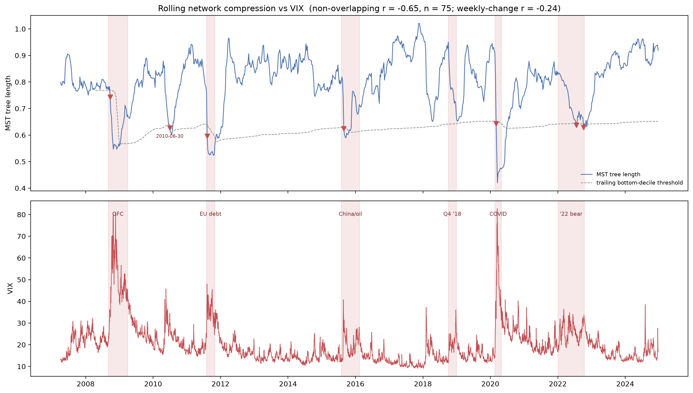
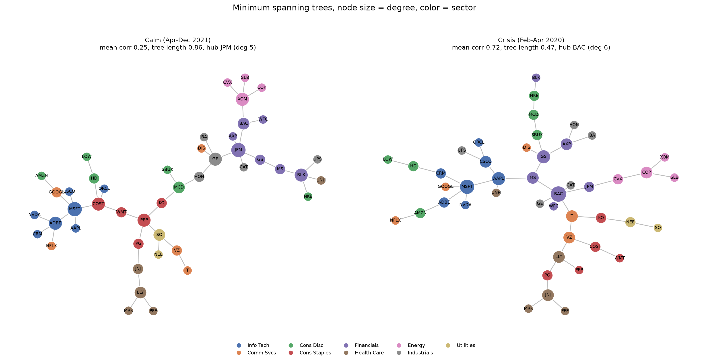

# Equity Correlation Network

This project treats the U.S. equity market as a network and tracks how that
network changes when the market is under stress. It builds a filtered
correlation graph (a minimum spanning tree) out of daily returns, and then
runs that construction on a rolling basis over 2007 to 2024 to produce a
systemic-risk series. That series is checked against the VIX to see whether it
actually captures market stress.

TLDR; when volatility rises, stocks start moving
together, the correlation distances between them shrink, and the spanning tree
gets shorter. So the tree length runs opposite to the VIX. On the sample here
that relationship is strong and statistically significant.

## What the code produces

Running `main.py` creates two figures and a set of CSVs in `output/`.




1. `rolling_vs_vix.png`. The rolling MST tree length on top, the VIX on the
   bottom, with major selloffs shaded. The tree length dips at each shaded
   period while the VIX spikes. The console prints the Pearson and Spearman
   correlations between the two, plus the correlation between average pairwise
   correlation and the VIX.

2. `mst_comparison.png`. A side-by-side look at the network in a calm window
   (2021) and the COVID crash (early 2020), with nodes colored by sector and
   sized by degree. This is the static picture behind the rolling series: you
   can see the crisis tree collapse toward a hub.

CSV output includes the rolling series, the calm-vs-crisis metric table, and
per-stock centrality for both windows.

## Method

For each window of daily log returns:

1. Compute the Pearson correlation matrix.
2. Convert correlations to distances with `d = sqrt(2 * (1 - rho))`. Two stocks
   that move together sit close, two that move opposite sit far.
3. Build the minimum spanning tree, the set of `N - 1` edges that connects
   every stock with the least total distance. This keeps the backbone of the
   correlation structure and drops the rest.
4. Take the average edge length as the tree length. A shorter tree means a
   tighter, more correlated market.

The rolling version repeats this on a 60-day trailing window, stepped one week
at a time, from 2007 to 2024. The snapshot version does it once each for a
calm and a crisis window and draws the trees.

This follows the approach in Mantegna (1999).

## Project layout

```
equity-correlation-network/
  config.py           universe, sectors, date windows, all parameters
  data_loader.py      price and VIX download with local CSV caching
  network_builder.py  correlation, distance, MST, centrality metrics
  rolling.py          rolling tree-length series and the VIX validation
  analysis.py         calm-vs-crisis comparison and CSV output
  visualize.py        both figures
  main.py             runs everything
  requirements.txt
  data/               cached prices land here (git-ignored)
  output/             figures and CSVs land here (git-ignored)
```

## Running it in PyCharm on Windows

1. Open the folder in PyCharm with File then Open.
2. When PyCharm offers to make a virtual environment, accept it. Otherwise go
   to Settings, Project, Python Interpreter, Add Interpreter, Add Local
   Interpreter, Virtualenv Environment. Use Python 3.10 or newer.
3. In the Terminal tab at the bottom, run `pip install -r requirements.txt`.
4. Open `main.py` and hit the green Run arrow.

The first run downloads about 18 years of daily prices for the universe plus
the VIX, and caches them to `data/`. That download takes a minute or two. Every
run after that reads the cache and finishes in a few seconds. There are no API
keys to set up, since Yahoo Finance is free and keyless.

## Reading the output

The number to look at is the Pearson correlation between tree length and the
VIX, printed to the console and shown in the figure title. It should be
negative. A value around -0.5 or stronger means the network signal is tracking
market stress well. The mean-correlation-versus-VIX number should be positive
and similar in size.

In the snapshot table, compare the crisis column to the calm column. Mean
pairwise correlation should be higher in the crisis, tree length lower, and the
max degree higher, since the tree becomes more star-shaped as one or two names
start driving everything.

## Changing the setup

Everything adjustable is in `config.py`.

- `ROLL_WINDOW` and `ROLL_STEP` set the trailing window length and how far it
  advances each step. A longer window is smoother but slower to react.
- `CALM_WINDOW` and `CRISIS_WINDOW` pick the two snapshot periods.
- `CRISIS_SPANS` is the list of shaded stress periods on the time-series plot.
- `TICKER_SECTORS` is the universe. Add or drop names here. The rolling code
  only uses names that have a full window of history at each point in time, so
  adding a recent IPO will not break earlier parts of the series.

## Limitations worth knowing

- The universe is a fixed set of large caps chosen by hand, not the live S&P
  500 membership over time, so there is some survivorship bias. Names that were
  large in 2007 but later failed or were acquired are not in here. Extending to
  point-in-time membership would remove that bias but adds a fair amount of
  data plumbing.
- Correlations are plain Pearson on daily returns. They say nothing about lead
  and lag between stocks, only contemporaneous co-movement.
- The MST is one filtering choice. The planar maximally filtered graph keeps
  more of the structure and is a natural next step.
- The VIX check shows co-movement, not that the network signal predicts
  anything ahead of time. Testing whether tree length leads the VIX would need
  a proper lead-lag or forecasting setup.

## Extending it

- Rebuild the universe from point-in-time S&P 500 membership to remove the
  survivorship bias.
- Add the planar maximally filtered graph as a second filter and compare it to
  the MST.
- Shift the rolling series forward against future realized volatility to test
  whether it has any predictive content rather than just tracking the VIX.

## Reference

Mantegna, R. N. (1999). Hierarchical structure in financial markets. European
Physical Journal B, 11(1), 193 to 197.
